# 基于springboot+vue的共享汽车管理系统

<h4 style='color:red'>联系不到我，就看我的主页 </h4> 
 
#### 介绍

随着共享经济的兴起，共享汽车作为一种便捷、环保的出行方式受到了越来越多的关注。为了实现共享汽车的高效管理和优质服务，我们开发了这款基于 Spring Boot + Vue 的共享汽车管理系统。该系统旨在为管理员和用户提供一个便捷、可靠的平台，以提升共享汽车的运营效率和用户体验。

#### 技术栈

后端技术栈：Springboot+Mysql+Maven

前端技术栈：Vue+Html+Css+Javascript+ElementUI

开发工具：Idea+Vscode+Navicate

#### 系统功能介绍

（一）管理员角色    
个人中心：管理员可以在个人中心查看和修改个人信息，设置系统通知偏好等。  
用户管理：对注册用户的信息进行全面管理，包括审核新用户注册申请、查看和修改用户资料、封禁违规用户等操作，以确保用户信息的真实性和安全性。  
投放地区管理：规划和设置共享汽车的投放区域，包括城市、区域、具体的停车点等。可以根据不同地区的需求和交通状况，合理分配车辆资源。  
汽车信息管理：详细记录每辆共享汽车的基本信息，如车型、车牌号、车辆颜色、车辆状态（可用、维修、报废等）、续航里程等，方便对车辆进行跟踪和管理。  
汽车投放管理：根据市场需求和投放地区的规划，安排共享汽车的投放数量和时间。同时，监控车辆的投放过程，确保车辆按时、准确地投放到指定地点。  
汽车入库管理：当共享汽车需要进行维修、保养或其他原因需要入库时，进行相应的登记和管理，记录入库时间、原因、预计出库时间等信息。  
使用订单管理：查看和处理用户的使用订单，包括订单的生成、支付状态、行程信息等。对异常订单（如未支付、超时未还车等）进行处理和跟踪。  
汽车归还管理：在用户归还共享汽车时，进行车辆的验收和检查，确认车辆是否完好无损、里程和电量等数据是否准确。如有异常情况，按照规定进行处理和收费。  

（二）用户角色  
个人中心：用户在此可以修改个人资料、查看历史订单、设置支付方式等。  
汽车投放管理：查看共享汽车在各个地区的投放情况，了解车辆的分布和可用性，以便选择合适的车辆进行预订。  
使用订单管理：发起使用共享汽车的订单，选择取车和还车地点、时间，支付订单费用。在使用过程中，还可以查看订单状态和行程详情。  
汽车归还管理：按照规定的流程归还共享汽车，确认车辆的停放位置和状态，完成订单的结束操作。  

#### 系统作用

提升运营效率  
为管理员提供了集中化、自动化的管理工具，实现了对共享汽车从投放、使用到归还的全流程监控和管理，大大提高了运营效率，降低了管理成本。  
优化用户体验  
用户可以通过系统方便地查找可用车辆、预订车辆、使用车辆和归还车辆，整个过程简单快捷，提升了用户的满意度和忠诚度。  
保障车辆安全  
系统对车辆的使用和归还进行严格的检查和管理，及时发现和处理车辆的损坏和故障，保障了车辆的安全和正常运行。  
数据分析与决策支持  
通过对用户使用数据、车辆运营数据的收集和分析，为企业的决策提供了有力依据，有助于优化车辆投放策略、定价策略和服务改进。  
促进共享经济发展  
高效的共享汽车管理系统有助于推动共享经济模式在交通领域的发展，减少私人车辆的拥有量，缓解交通拥堵和环境污染问题。  

#### 系统功能截图

代码结构

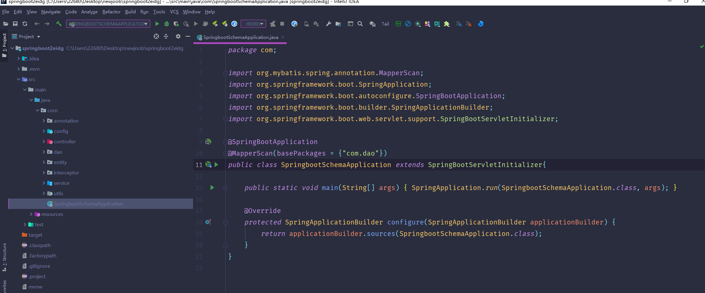

数据库表

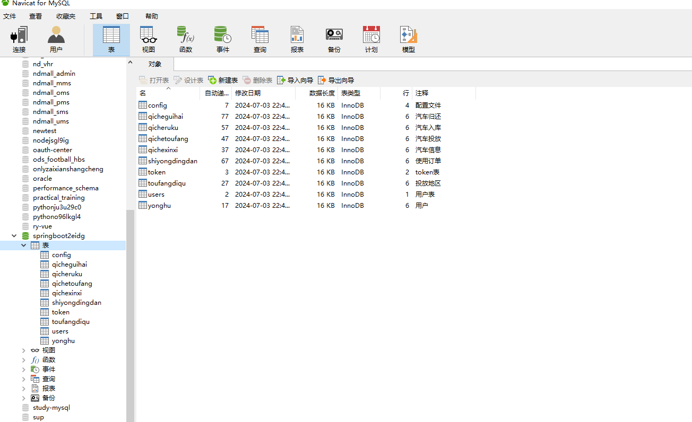

登录

管理员端个人信息

用户管理

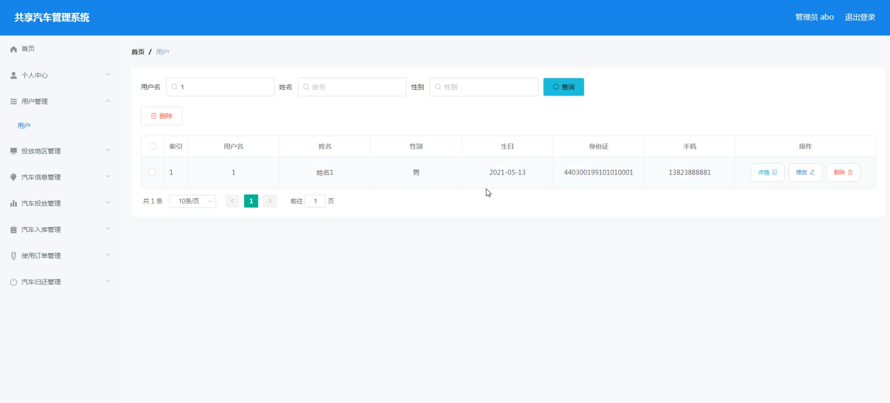

投放地区管理

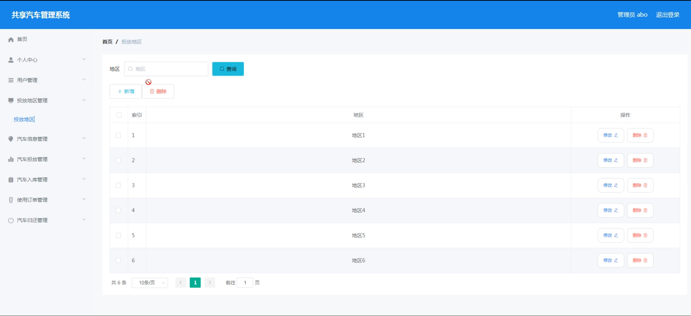

汽车信息管理

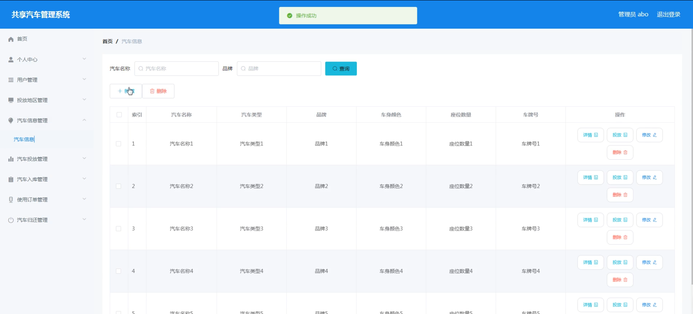

汽车投放管理

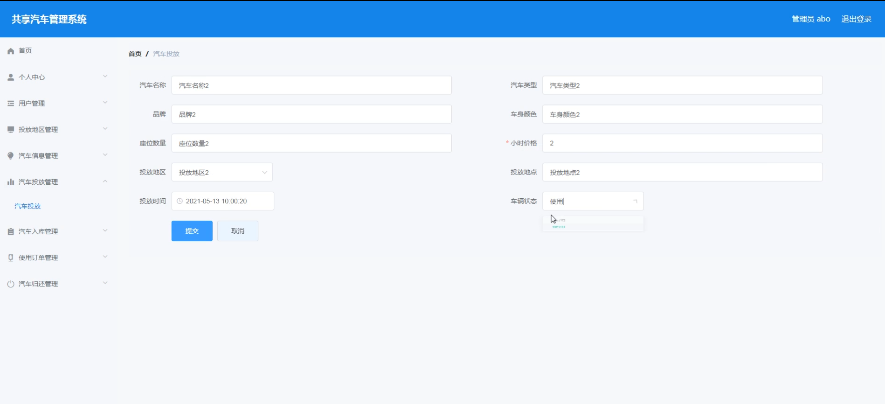

汽车入库管理

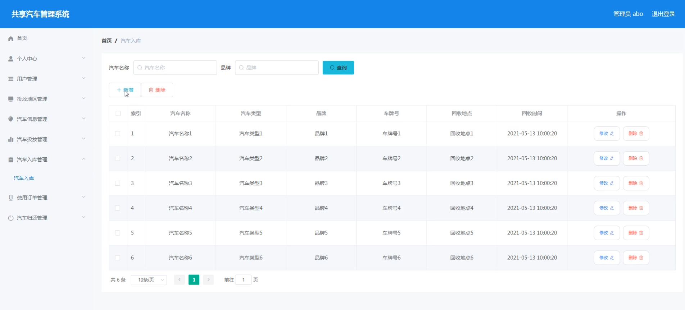

用户端个人信息

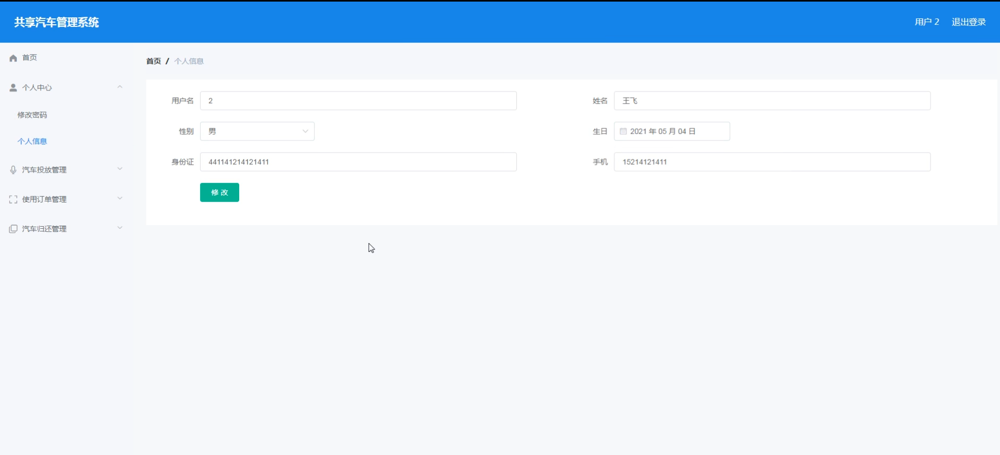

汽车投放

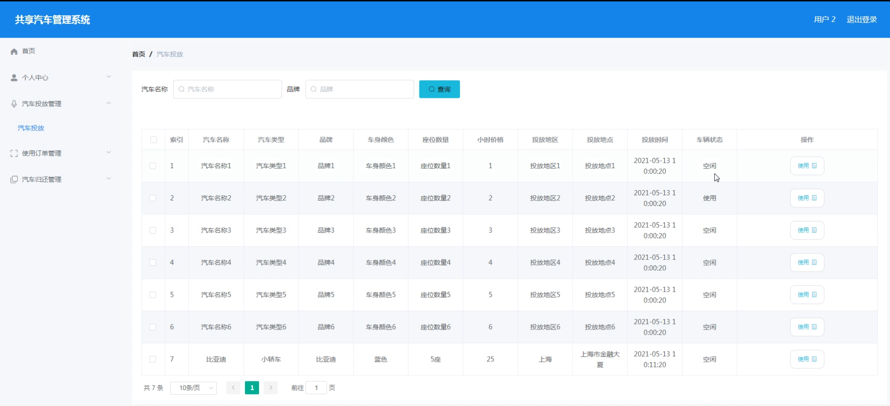

使用订单管理

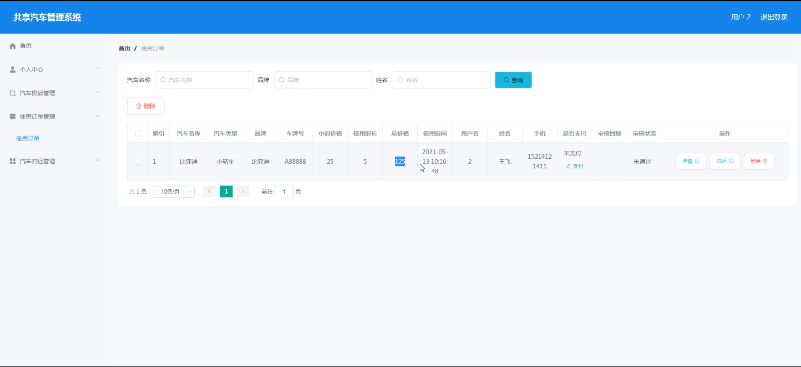

汽车归还

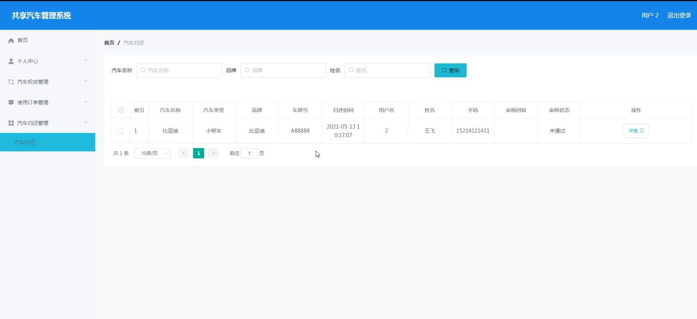

#### 总结

基于 Spring Boot + Vue 的共享汽车管理系统通过清晰的角色划分和丰富实用的功能模块，实现了共享汽车运营的数字化和智能化管理。它不仅为企业提供了高效的运营工具，也为用户带来了便捷的出行体验。未来，随着技术的不断创新和市场需求的变化，系统将持续优化和完善，为共享汽车行业的发展注入新的活力。

#### 使用说明

创建数据库，执行数据库脚本 修改jdbc数据库连接参数 下载安装maven依赖jar 启动idea中的springboot项目